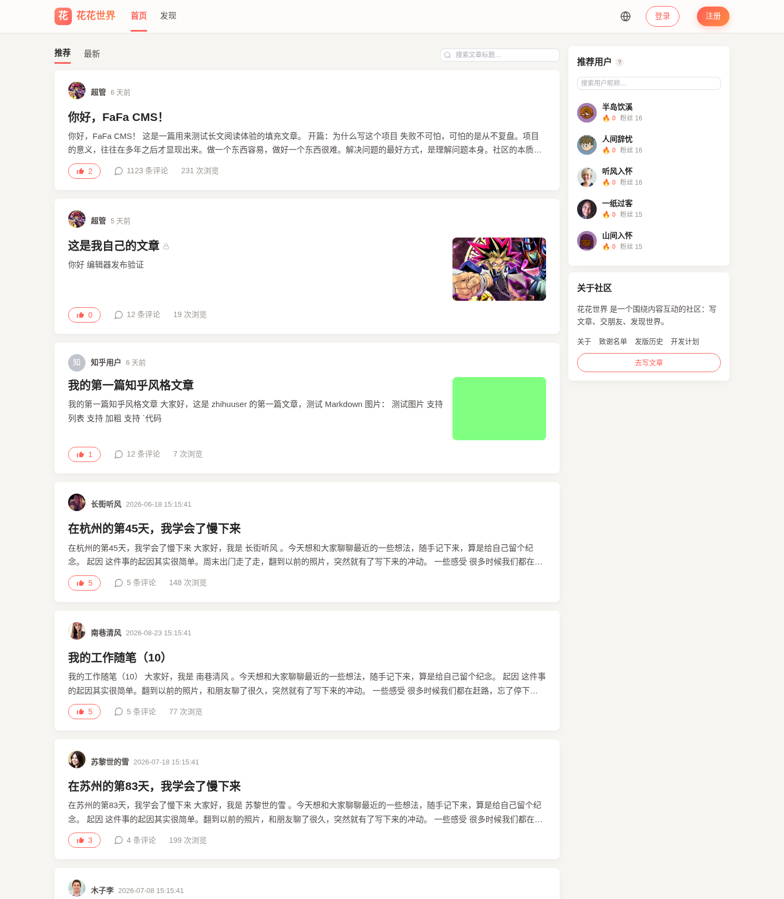
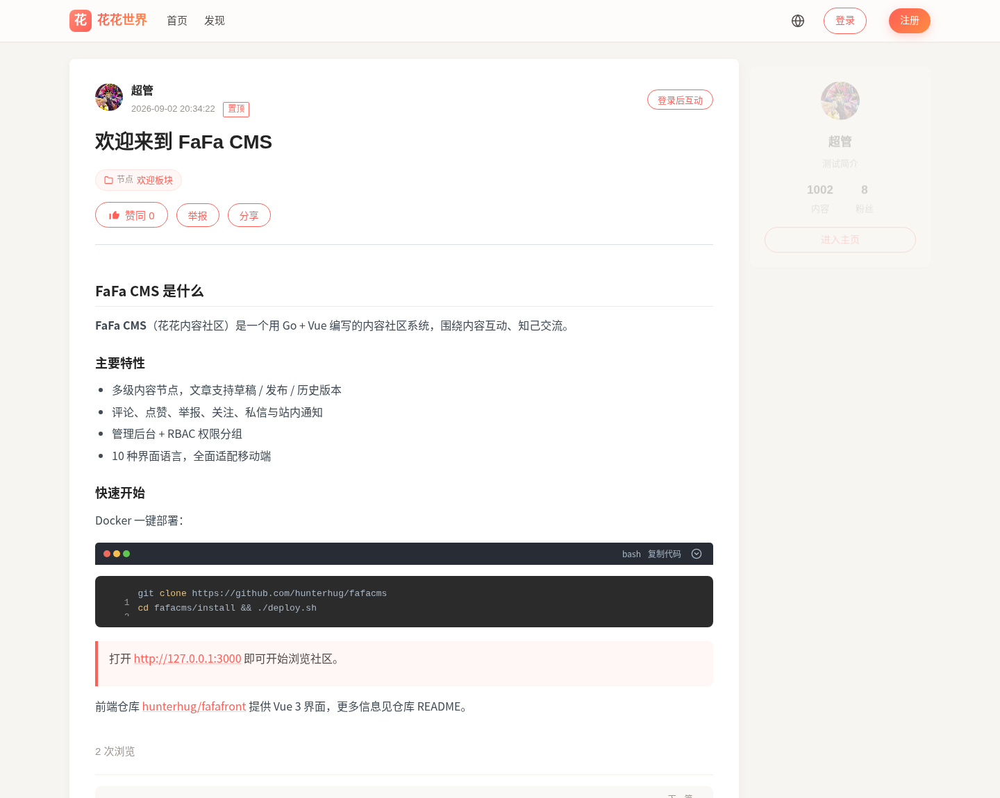
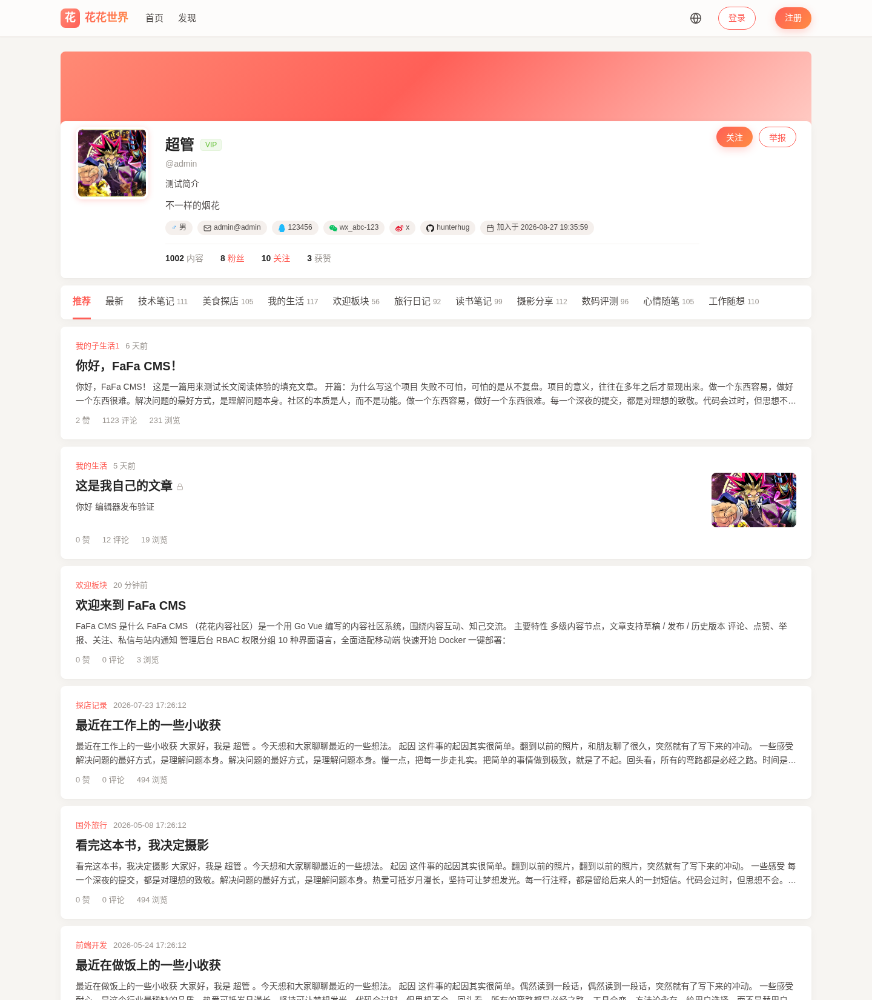
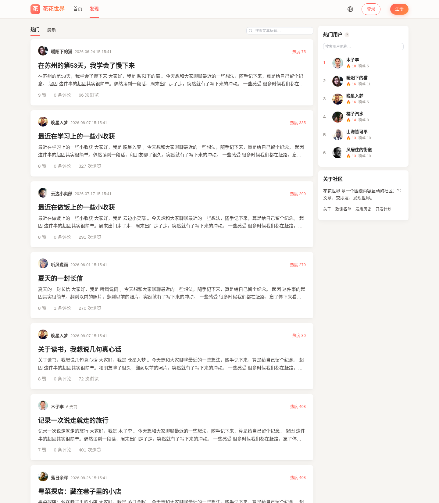
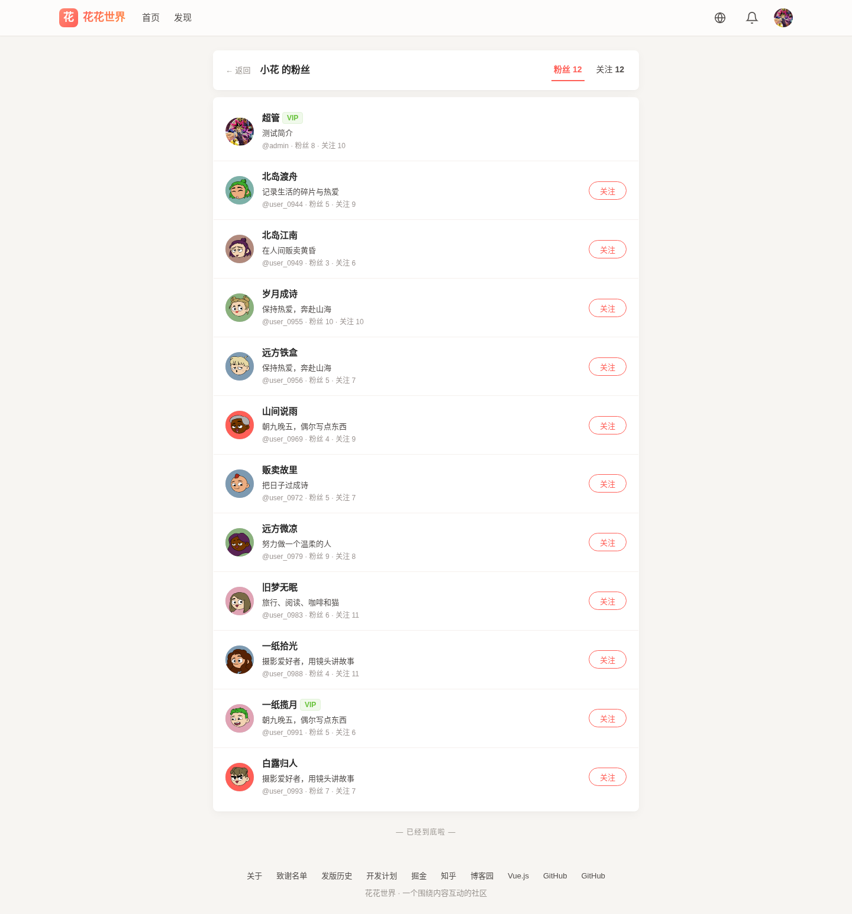
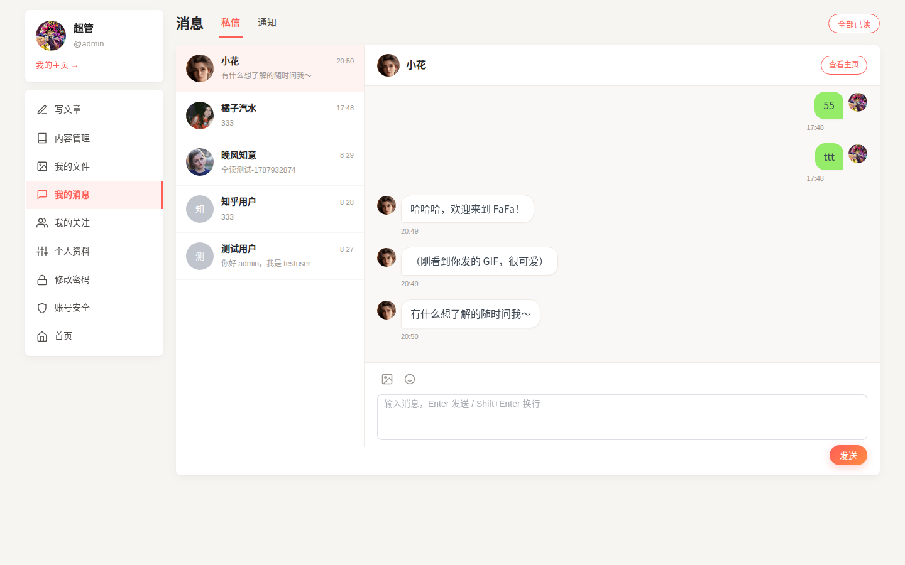

# 花花内容社区：前端

> 🌐 [English](README_EN.md) · 简体中文 · [关于](https://github.com/hunterhug/fafacms/blob/master/ABOUT.md)

[](https://github.com/hunterhug/fafafront/network)
[](https://github.com/hunterhug/fafafront/stargazers)
[](https://github.com/hunterhug/fafafront)
[](https://github.com/hunterhug/fafafront/issues)

FaFa CMS（花花内容社区）的前端仓库，技术栈 **Vue 3 + Vite + Element Plus**。当前与后端 [hunterhug/fafacms](https://github.com/hunterhug/fafacms) 配套。

## 功能一览

- 首页推荐 / 发现热门 / 最新内容，按内容互动热度排序，支持标题搜索
- 个人官网（/u/xxx）：节点树 + 文章列表，支持多级内容节点
- SEO 地址：节点页 `/u/xxx/node/节点SEO`、文章页 `/u/xxx/node/节点SEO/文章SEO`；SEO 默认随机生成、可手改并查重；节点可隐藏（隐藏后其下文章退出公开列表，作者本人仍可见）
- 站点品牌可配置：网站标题 / 副标题 / 社区介绍 / 页脚介绍都在管理后台改，页头 Logo 与 favicon 为猫爪图形
- 长文阅读：正文超过 2000 字自动出右侧目录，滚动时目录跟随高亮并自动滚动到当前章节
- 文章阅读：Markdown 排版、点赞、评论（楼中楼）、收藏交互、密码文章
- 写文章：全屏所见即所得编辑器、拖拽排序、草稿/发布/历史版本
- 消息中心：站内通知（评论/点赞/关注/违禁）分类、私信会话
- 个人中心：资料、账号安全（2FA）、文件管理、内容管理、回收站
- 管理后台：用户/内容/评论/举报/通知/友情链接/站点配置，RBAC 权限分组
- 国际化：10 种界面语言（中/英/日/韩/德/法/西/葡/意/俄）
- 移动端全面适配（响应式布局、底部导航、全屏聊天/编辑器）

## 产品展示

| 首页推荐 | 内容详情 | 个人主页 |
| --- | --- | --- |
|  |  |  |

| 发现 / 最新 | 粉丝 | 关注 |
| --- | --- | --- |
|  |  |  |

| 登录 | 个人中心 | 管理后台 |
| --- | --- | --- |
|  |  |  |

| 站内通知 | 私信聊天 |
| --- | --- |
|  |  |

## 技术栈

Vue 3 · Vite · Element Plus · Pinia · vue-router · md-editor-v3 · vuedraggable

## 本地开发

需要先启动后端（见后端仓库 `install/README.md`，`./deploy.sh` 一键拉起）。

```bash
cd web
npm install
npm run dev
```

启动后访问 [http://127.0.0.1:3000](http://127.0.0.1:3000/)。

开发服务器（`web/vite.config.js`）会自动代理到后端 `127.0.0.1:8080`：

- `/app/*` → 后端 `/*`（公开接口）
- `/api/*` → 后端 `/v1/*`（登录后接口）
- `/storage/*`、`/storage_x/*` → 后端静态文件

## Docker 一键部署

在仓库根目录：

```bash
./deploy.sh
```

会构建前端镜像（Vite build → nginx 静态托管），以 nginx 容器跑在 `:3000`，并反代 `/api`、`/app`、`/storage` 到后端。控制台会打印访问地址（含局域网 IP）。

```bash
./deploy.sh up        # 启动（默认）
./deploy.sh down      # 停止
./deploy.sh logs      # 查看日志
./deploy.sh rebuild   # 重新构建
```

- 后端地址默认走共享 Docker 网络 `fafacms:8080`（与后端仓库同机部署时无需配置）。
- 跨机部署时设置：`BACKEND_UPSTREAM=后端IP:8080 ./deploy.sh rebuild`。

## 产品 / 前端文档

本仓库 `docs/` 为产品文档（docsify 形式，与后端接口文档同风格），记录推荐规则、页面与交互、需求与变动记录。

部署后（`./deploy.sh up`）随前端一起以 docsify 容器提供，访问 **http://127.0.0.1:8889**。

- 推荐规则：[docs/recommendation.md](docs/recommendation.md)
- 页面与交互：[docs/pages.md](docs/pages.md)
- 需求与变动记录：[docs/changelog.md](docs/changelog.md)

# License

本项目采用 [GNU Affero General Public License v3.0](https://www.gnu.org/licenses/agpl-3.0.html)（AGPL-3.0）许可。

你可以自由使用、修改和分发本项目，包括用于商业目的；但若你基于本项目向网络用户提供服务，AGPL-3.0 要求你向这些用户提供对应的完整源代码。完整条款见 [LICENSE](LICENSE)。

## 致谢

- [致谢名单](ACKNOWLEDGMENTS.md)：感谢每一位为本项目做出贡献的开发者。
